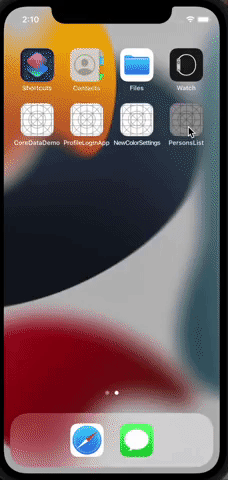

# PersonsList

## Учебный проэкт
Приложение список контактов.
Приложение имеет список контактов, представленный двумя разными способами.
Первый способ представляет собой TableView с детальной информацией по контаку (Имя, Фамилия, Номер телефона, Почта)
Второй способ представляет собой TableView со списком Имя-Фамилия, при нажатии на ячейку списка осуществляется переход на экран с детальной информацией (Имя, Фамилия, Номер телефона, Почта)
Реализованно по схеме MVC.

## Educational project
Contact list app.
The application has a contact list presented in two different ways.
The first method is a TableView with detailed contact information (First Name, Last Name, Phone Number, Mail)
The second method is a TableView with a list of First Name and Last Name, when you click on a cell of the list, you go to the screen with detailed information (First Name, Last Name, Phone Number, Mail)
Implemented according to the MVC scheme.

